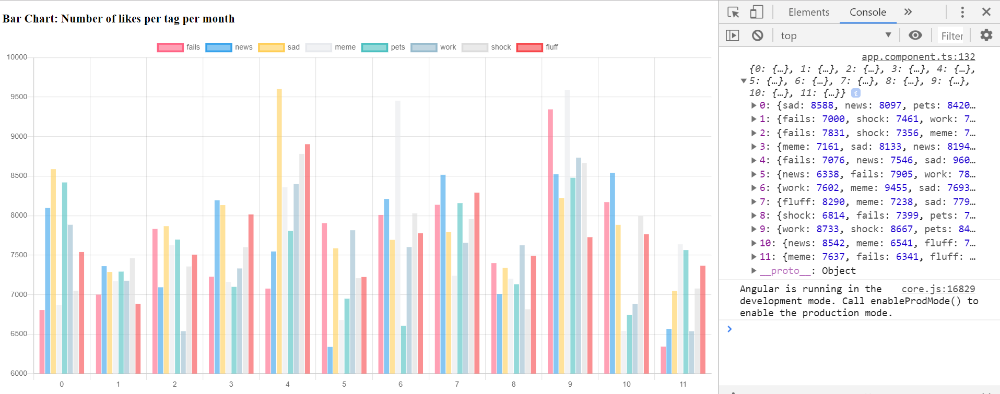
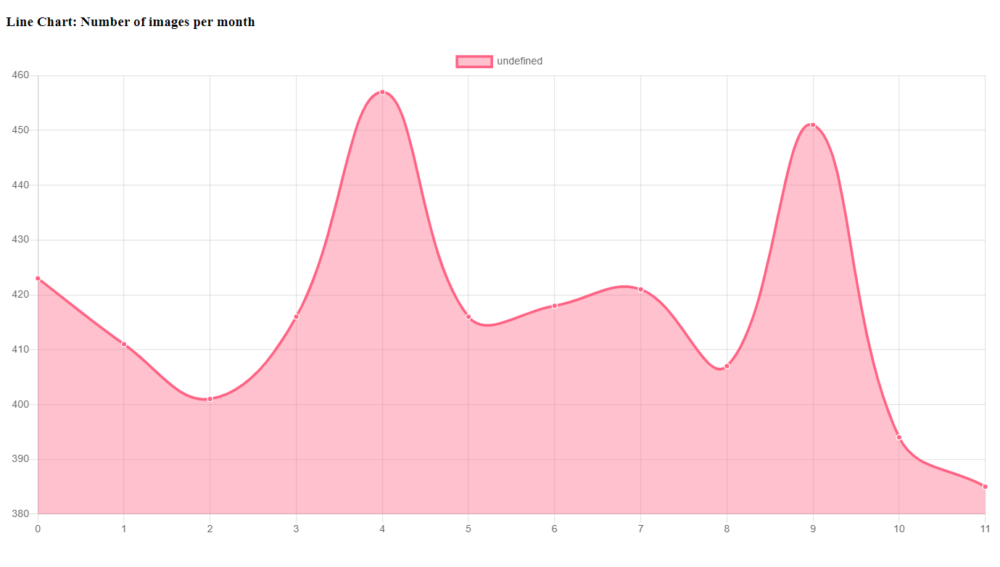
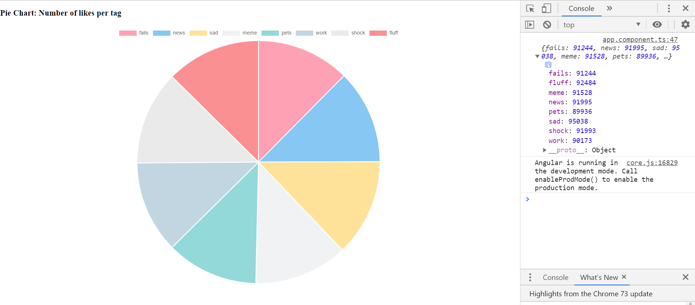

### Building Charts

---

### External Libraries

- use code written by other developers
- don't reinvent the wheel
- avoid custom solution for standardized tasks
- ease of maintainance

---

### npm

- Node Package Manager
- enables downloading and using external libraries

+++

### package.json

- a list of all the external libraries in your project
- running <span class="text-blue">npm install (library-name)</span> adds to this list

+++

### npm install

- downloads library source code to the <span class="text-blue">node_modules</span> folder
- cloning a new Javascript project
- another developer changing the project dependencies 

---

### Integrating Charts into Angular

- [chart.js](https://www.chartjs.org/)
- [ng2-charts](https://valor-software.com/ng2-charts)

---

### How to use external packages

- read the [docs](https://valor-software.com/ng2-charts)
- check the <span class="text-gold">General Info -> Usage</span> section
- check the examples
- each example has a <span class="text-gold">Markup</span> and <span class="text-gold">TypeScript</span> section

---

### Exercise

- implement a basic line chart

```ts
horizontal: x, y, z
series 1: {x: 10, y: 20, z: 30}
series 2:  {x: 5, y: 30, z: 15}
```

+++

### Exercise


- implement a basic bar chart

```ts
horizontal: a, b, c, d
series 1: {a: 5, b: 15, c: 14, d: 7}
series 2:  {a: 10, b: 12, c: 8, d: 8}
```

+++

1### Exercise

- implement a basic pie chart

```ts
laptop: 50
handphone: 20
tablets: 40
```

---

### Assignment

- clone [this](https://github.com/cmh114933/data-dashboard-example) template repository
- import [this](https://gist.github.com/mingxiangchan/e62818b558c28d61c412cd8362a4a200) data into the project
- you can check [this docs](https://devdocs.io/javascript/global_objects/array) for docs on how to manipulate arrays
- build the following 3 charts

---

### Bar Chart

- number of likes per tag

+++



---

### Line Chart

- number of images per month

+++



---

### Pie Chart

- number of images per tag

+++


