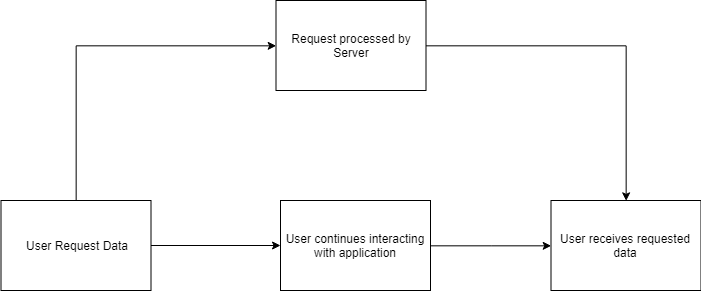
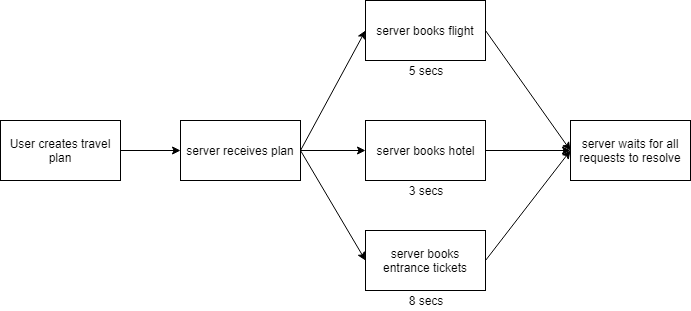
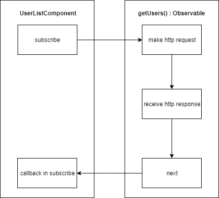
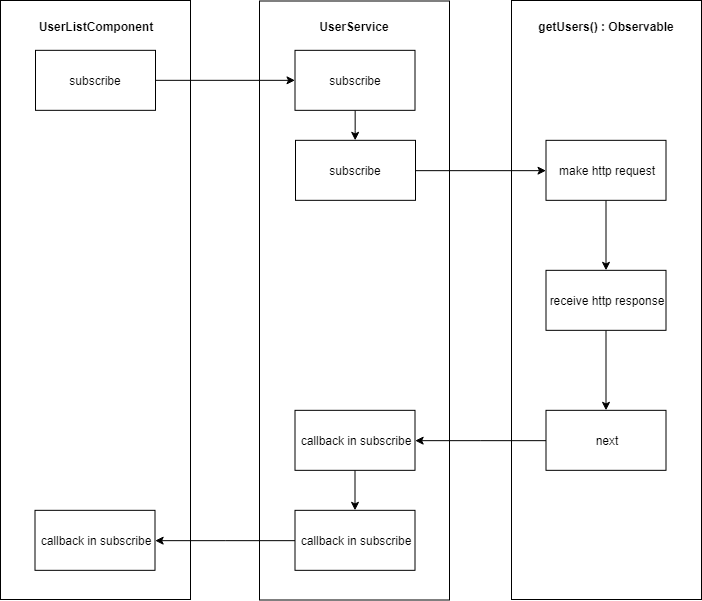

## Observables

---

### Recap Exercise

1. Clone [this repository](https://github.com/mingxiangchan/dell-observables)
2. Change the checkboxes to use Angular Forms
3. Add a feature to rename the list (use a text form)

+++

### Further requirements

1. Refactor the list data to come from the <span class="text-gold">TodosService</span>
2. Add a new feature, when clicking a list on the left side
    - right side will change to that list and its items

---

### Why Observables

- data can be stored in services
- updates to that data is not always reflected
- can manually control how to access data in service

---

#### Initializing (In Service)

```ts
// variable_name = new BehaviourSubject<type>(initial_value)
age = new BehaviourSubject<int>(15)
```

#### Reading (In Component)

```ts
this.service.age.subscribe(age => {
    // do things with the data
    this.age = age
})
```

### Writing (In Service)

```ts
const newAge = 23
this.age.next(23)
```

---

### Used when dealing with
- Asynchronous data
- Multiple data values

+++

## Asynchronous

+++



+++



---

### Observable is a notifier to all observers watching a particular value

+++

- an observer <b>subscribes</b> to an observable
- when a change is identified to the value
- a notification will be <b>published</b> to all <b>subscribed</b> observers

+++



---

### Chained Observables

+++


