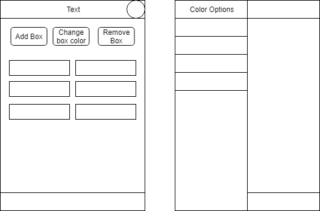
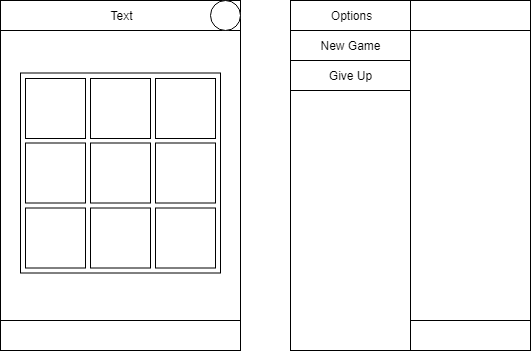
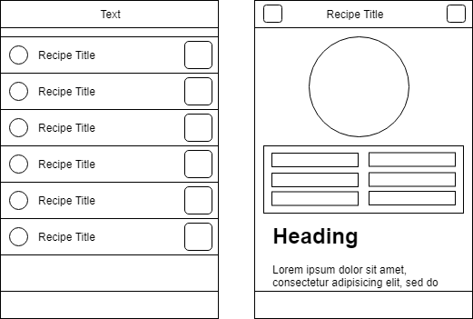

### About Ionic
- [Documentation](https://ionicframework.com/docs/components)
- [Icons](https://ionicons.com/)
+++

### What
- A library of reusable components, built using HTML, CSS, and JS
- Highly customizable
- Provides access to native functionality (Mobile Notifications, Camera)
- Navigation with Angular

+++

### Why: One For All
- One single codebase for all platforms (Android, IOS, Web)

+++

### Additional
- Themes

---

### Ionic Setup
- Download the `Ionic DevApp` from the store of your choice
- Run the following commands:
    ```bash
    npm install -g ionic
    ionic start <app-name> template
    # template options: blank, tabs, sidemenu
    ionic serve

    # To test on mobile
    ionic cordova prepare <platform>
    # platform options: ios, android
    ionic serve --devapp

    ionic generate <schema> <name>
    ```
---

### What makes up an Ionic Project?
- Your app
  - Your Code
  - Frontend Framework (Angular)
  - Ionic Framework
- Bridge: Cordova
- Targeted Host: Android/IOS
+++

### Bridge: Cordova
- Web to Native application bridge
- Allows you to trigger native functions through web application
- Functions such as:
  - Open Camera
  - Get user location
  - Show notification

---

### Compile VS Web View

+++

### Compile
- converts code to native code for platform
- ios: objective C
- android: java

+++

### Web View
- runs a Web View within the app shell and loads your app
- uses Cordova to enable the web app to access native device feature
- a normal website run in a browser does not have this capability

---

### Core Concepts
- Components
- Layouts
- Routing/Navigation

+++

### Components
- Ionic Components function the same as Angular Components
- Except that they are :
  - built to be able to respond to platform differences
  - have additional functionality related to mobile apps
- E.g: ion-button, etc

+++

### Layout
- Mobile applications have different layout, though in general:
  - Header
  - Footer
  - Tabs
  - Menu
- Ionic uses a 12 column grid format for layouts
  - ion-grid, ion-row, ion-col

+++

### Navigation
- Ionic extends upon the Angular Routing module
- Functions mostly the same, but introduces the concept of Stacks

---

### Component and Layout Demo
- change toolbar background color
- show an alert before changing box colors

+++



---

### Exercise 1: Tic Tac Toe
- Header: Tic Tac Toe game
  - Add a header button to toggle side menu
- Footer: Win Ratio - 100%
- Build a tic tac toe board
  - click on cell to play move
- Side Menu
  - `New Game` menu option to reset the board
  - `Give up` to disable tapping on the board

+++



---

### Routing/Navigation Demo
- ToDoList
- Navigate to specific task
- Introducing Action Sheet

---

### Exercise 2: Recipe Application
- Build 2 pages
- 1st page: RecipeList
  - List of recipes
  - Each list item should show a thumbnail of the food, a label, and a button
  - Tapping on button will open an action sheet
    - Go To : Navigate to specific recipe
    - Remove : Remove from list of recipes
    - Favourite : Highlights the recipe

+++



+++

- 2nd page: RecipeDetail
  - detail of a specific recipe
  - Has an enlarged image
  - has a list of ingredient and step by step instructions
  - Back button on header
  - Delete button on header
    - will prompt an alert to confirm delete
    - will redirect to RecipeList after delete

---

### Tab Layout Demo

---

### Exercise 3: Shopping Cart
- Has 3 tabs
- Tab 1: Homepage
  - Shows total purchase amount
- Tab 2: Product Page
  - Shows list of products
    - Each product has an image, a quantity, a + button and - button to modify quantity, pirce, and an Add to Cart button
    - On tap add to cart, add the product to user's shopping cart
    - On tap product, navigate to product details page
- Tab 3: My Shopping Cart Page
  - Shows list of items in shopping
    - Each list item only shows label, quantity, single price, and a delete button
    - on tap delete button, remove item from shopping cart 
  

