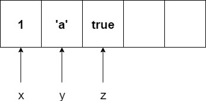
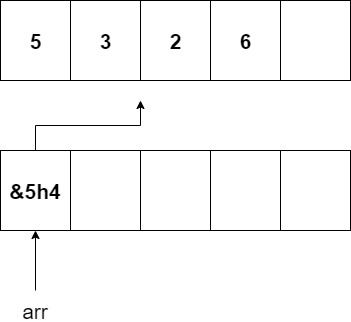

### .NET 2

+++

### Topics

- C# classes
- Reference vs Value Types
- Entity Framework

---

#### C# Classes

```csharp
public class User {
    // fields
    public string username;

    // methods
    public string Greeting() 
    {
        return "Hello!";
    }

}
```

+++

### Constructors

- similar to Java
- can have multiple constructors
- constructors are not inherited

---

#### Getter/Setters

```csharp
public class User {
    // convention for private fields, start with underscore
    private string _Username;

    // getter/setters
    public string Username {
        get { return _Username; }
        set { _Username = value; }
    }
}
```

AutoImplemented Getter/Setters

```csharp
public class User {
    public string Username { get; set; } 
}
```

---

### Exercise: Book Class

- fields:
    1. title
    2. pageNum
- properties:
    1. Content: getter only
    2. Author: setter only
    3. Publisher: both (long form)
    4. Rating: both (short form)

---

### Discussion

Read [this](https://dev.to/scottshipp/avoid-getters-and-setters-whenever-possible-c8m) article 

Write 200 words on what you understand from it.

---

#### Inheritance

```csharp
class Employee : User
{
    // code specific to admins
}

class Admin : User
{
    // code specific to admins
}
```

---

### Overriding Methods

```csharp
class User 
{
    public virtual void Greeting() 
    {
        Console.WriteLine("Hello");
    }
}

class Employee : User
{
    public override void Greeting()
    {
        Console.WriteLine("Hello Boss!");
    }
}
```

+++

- can declare properties and methods to be virtual
- only virtual methods can be overriden
- methods are non-virtual by default

---

### Exercise: Book Class
- Virtual Property
    - Fun: return true
    - Knowledge: return true
- Virtual Method
    - Read -> write a print statement

+++

### Exercise: StoryBook
- inherits from Book
- Knowledge returns false
- Fun returns true
- change the Read method to print something else

+++

### Exercise: TextBook
- inherits from Book
- Knowledge returns true
- Fun returns false
- change the Read method to print something else

---

### Abstract

```csharp
abstract class User
{
    public abstract int Greeting();
}

class Employee : User
{
    public override int Greeting();
}
```

+++

- abstract classes cannot be instantiated
- abstract methods MUST be implemented by child class

---

### Structs

```csharp
struct User 
{
    public string username;
    public string email
}
```

+++

- class is a reference type, struct is a value type
- structs cannot implement inheritance
- structs are more lightweight than classes
- only use structs if the data doesn't change
- read more [here](https://www.c-sharpcorner.com/blogs/difference-between-struct-and-class-in-c-sharp)

---

### Exercise: MapData

- a struct containing
    - lng
    - lat
    - altitude

- construct 3 instances of MapData for:
    - Kuala Lumpur
    - New York
    - Mount Everest

---

### Reference vs Value Types

- value types are stored directly in memory
- references types store the pointer to the value

---

### Value Types

- all primitives
- int
- char
- boolean

+++



---

### Reference Types

- strings
- arrays
- objects
- dictionaries

+++



---

## Entity Framework

+++

## Topics

- connecting to DB
- entities
- queries
- updating
- associations

---

### Commands

- run from `Package Manager Console`

```powershell
# installing packages
Install-Package Microsoft.EntityFrameworkCore.Design
Install-Package Microsoft.EntityFrameworkCore.SQLServer

# generate migrations
add-migration MigrationName

# run migration
Update-Database
```

---

### Entity

```csharp
using Microsoft.EntityFrameworkCore;
using System.ComponentModel.DataAnnotations.Schema;

[Table("blogs")]
public class Blog
{
    [Key]
    [DatabaseGenerated(DatabaseGeneratedOption.Identity)]
    [Column("id")]
    public int Id { get; set; }

    [Column("url")]
    public string Url { get; set; }

    // for one to many
    public ICollection<Post> Posts { get; set; }
}
```

+++

[Here](https://docs.microsoft.com/en-us/ef/ef6/modeling/code-first/data-annotations) are the docs for more data annotations

---

### Context

```csharp
using Microsoft.EntityFrameworkCore;

public class MyContext : DbContext
{
    public DbSet<Blog> Blogs { get; set; }
    public DbSet<Post> Posts { get; set; }

    protected override void OnConfiguring(DbContextOptionsBuilder optionsBuilder)
    {
        var connectionString = "<your-connection-string>"
        optionsBuilder.UseSqlServer(connectionString);
    }
}
```
---

### Using Context

```csharp
 using (var db = new MyContext())
{
    db.Blogs.Add(new Blog { Url = "http://blogs.msdn.com/adonet" });
    var count = db.SaveChanges();

    Console.WriteLine("All blogs in database:");
    foreach (var blog in db.Blogs)
    {
        Console.WriteLine(" - {0}", blog.Url);
    }
}
```

---

### Exercise: Todo List

- able to view list of todos
- able to create a new todo
- able to edit a todo
- able to delete a todo
- write a test for each action

+++

### Todo Entity

- id: int
- description: string
- completed: boolean

---

### Assignment: Booking Service

- create an API endpoint
- allow you to check
    - list of hotels
    - list of flights
- allow you to book
    - a hotel stay
    - a one way or return flight
- all data should be stored in DB


