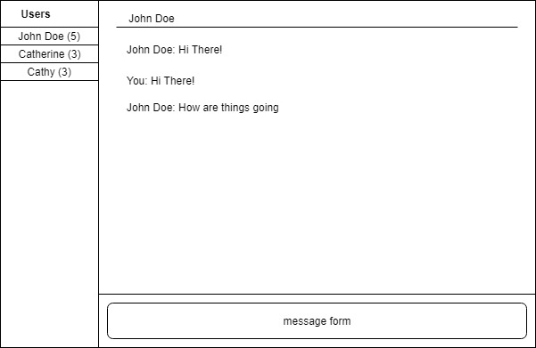

## Observables

---

### Recap Exercise

1. Clone [this repository](https://github.com/mingxiangchan/dell-observables)
2. Change the checkboxes to use Angular Forms
3. Add a feature to rename the list (use a text form)
4. Add the features to change the user details (using text forms)

+++

### Further requirements

1. Refactor the list data to come from the <span class="text-gold">TodosService</span>
2. Add a new feature, when clicking a list on the left side
    - right side will change to that list and its items

---

### Why Observables

- data can be stored in services
- updates to that data is not always reflected
- can manually control how to read/write data in service

---

#### Initializing (In Service)

```ts
// variable_name = new BehaviourSubject<type>(initial_value)
age = new BehaviourSubject<int>(15)
```

#### Reading (In Component)

```ts
this.service.age.subscribe(age => {
    // do things with the data
    this.age = age
})
```

#### Writing (In Service)

```ts
const newAge = 23
this.age.next(newAge)
```

---

### Concept

- an observer <b>subscribes</b> to an observable
- when a change is performed on the observable
- a notification will be <b>published</b> to all <b>subscribed</b> observers

---

### Exercise

- convert employee details changing to observables
    - name
    - role
    - id
- convert list renaming feature to observables

---

### Exercise

- create a slack clone

+++

### Features

- can view list of users
- can view list of messages for a chat
- can write a new message in the chat
    - validate blank, cannot exceed 255 chars
- can see total number of messages per chat

+++

### Layout


