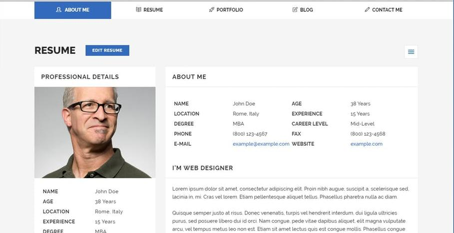

### CSS Basics

---

### Webpage Building Blocks

- HTML: content
- CSS: styling
- JS: interactivity

---

### Writing CSS

- Target HTML elements using `css selectors`
- Define CSS styling rules for targted elements

---

### Basic CSS: Text

- Changing text 
    - font family
    - alignment
    - colors
    - word-wrap

+++

- Change element
    - background color
    - borders
    - width/height/margins/padding

+++

### Links:

- [Background](https://devdocs.io/css/background)
- [Border](https://devdocs.io/css/border)
- [Font Styling](https://devdocs.io/css/font)
- [Font Color](https://devdocs.io/css/color)
- [Text Styling](https://devdocs.io/css-text/)

---

### CSS Selectors

- Using HTML element tag
- Using `class`
- Using `id`

+++

### Based on HTML element

```html
<body>
    Haha
    <p>Hello</p>
</body>
```


```css
body {
    color: red;
}

p {
    color: green;
}
```

+++

### Based on HTML class

```html
<div class="haha">
    Haha
</div>
<div class="hoho">
    Hoho
</div>
```


```css
.haha {
    color: red;
}

.hoho {
    color: green;
}
```

+++

### Based on HTML id

```html
<div id="haha">
    Haha
</div>
<div id="hoho">
    Hoho
</div>
```


```css
#haha {
    color: red;
}

#hoho {
    color: green;
}
```

+++

### Combined

```html
<div id="haha">
    Haha
</div>
<div class="hoho">
    Hoho
</div>
<p class="hoho">
    Hoho
</p>
```

```css
div#haha {
    color: red;
}

div.hoho {
    color: green;
}
```

+++

### Combined

```html
<div id="haha">
    Haha
    <p> Hoho </p>
    <div> Hehe </div>
</div>
```

```css
div#haha {
    color: red;
}

#haha p {
    color: green;
}

#haha div {
    color: yellow;
}
```

---

### Exercise


---

### CSS Layout

1. Everything is boxes
2. Start from the top-left
3. Child top-left -> Parent's top-left

---

### Box Model

- content
- padding
- border
- margin

+++


+++

### Exercise

- wireframe the resume site using [draw.io](https://www.draw.io/)
- draw the box model for each element in the wireframe
- consider which parts will be content/padding/margin

+++

### Exercise



---

### Positioning

- Start from top-left
- Child starts from parent `content`
- Use margin/padding/width/height to position

---

### Centering Elements

- text-align
- margin / padding
- flex
- position absolute

---

### Text-Align

```css
p {
    text-align: center;
}
```

+++

- only works for horizontal centering
- only reliable for text
- requires element `width` to be set correctly

---

### Margin / Padding

```html
<div id="parent">
    <div id="child"></div>
</div>
```

```css
#parent {
    width: 500px;
    height: 100px;
}

#child {
    /* horizontal-centering */
    width: 40%;
    margin-left: 30%;
    margin-right: 30%;

    /* vertical-centering */
    height: 40%;
    margin-top: 30%;
    margin-bottom: 30%;
}
```

+++

- works on the box level
- have to manually adjust if there are multiple child elements
    - e.g. child 1 is 20%, child 2 is 20%, margin left/right is 30%

---

### Flex

```html
<div id="parent">
    <div id="child"></div>
</div>
```

```css
#parent {
    display: flex;

    /* horizontal-centering */
    justify-content: center;

    /* vertical-centering */
    align-items: center;
}
```

+++

- all alignment properties set on parent
- very powerful centering abilities
- able to handle spacing between child elements
- may not be supported on older browsers

---

### Position Absolute

```html
<div id="parent">
    <div id="child"></div>
</div>
```

```css
#parent {
    position: relative;
}

#child {
    position: absolute;
    top: 50%;
    left: 50%;
    transform: translate(-50%, -50%);
}
```

+++

- most powerful positioning method
- will break all other alignment
- last resort


