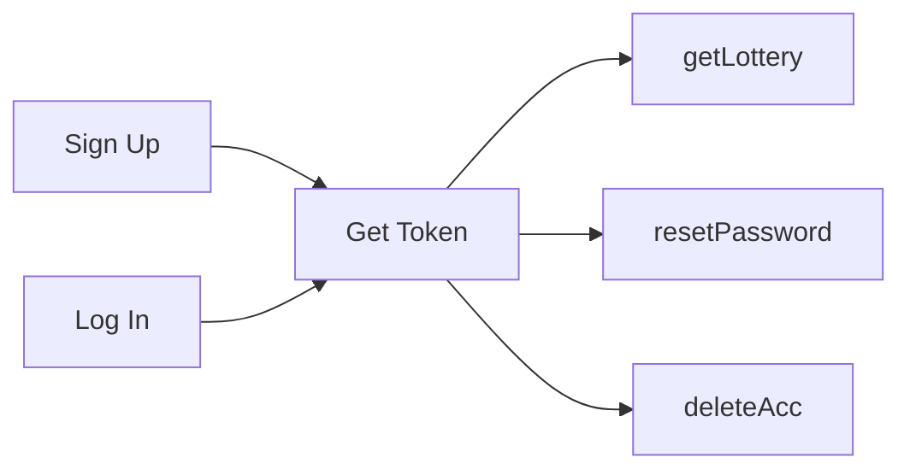

### Spring Session and Security

---

Recap:

1. render HTML
2. render JSON
3. query database using JDBC
4. query database using Spring Data/Hibernate

---

How do we differentiate logged in / non logged in users?

---

### HTTP is Stateless

+++

#### Each HTTP Request is:

- completely separate from the previous ones
- must prove it is authorized

+++?color=linear-gradient(90deg, white 50%, black 50%)

@snap[north-west span-40 text-white text-09]
@box[bg-green](Step 1. # Check in at hotel)
@snapend

@snap[west span-40 text-white text-09]
@box[bg-blue](Step 2. # Get room key)
@snapend

@snap[south-west span-40 text-white text-09]
@box[bg-gold](Step 3. # Every time you enter the room, tap key)
@snapend

@snap[north-east span-40 text-white text-09]
@box[bg-green](Step 1. # Login with username/password)
@snapend

@snap[east span-40 text-white text-09]
@box[bg-blue](Step 2. # Get authorization token)
@snapend

@snap[south-east span-40 text-white text-09]
@box[bg-gold](Step 3. # Attach token in HTTP headers for every request)
@snapend

+++

@snap[north span-100]
#### Authorization Storage Mechanisms
@snapend

@snap[east span-40 text-white text-09]
@box[bg-green](# sessions)
@snapend

@snap[midpoint span-40 text-white text-09]
@box[bg-blue](# cookies)
@snapend

@snap[west span-40 text-white text-09]
@box[bg-gold](# tokens)
@snapend

+++

### In this course...

- only teach token auth
- sessions/cookies inapplicable to API auth
- do you want to write Thymeleaf?

---

### 4 Main Sections

- Signing Up
- Logging In
- Authorized Requests
- Logging Out

+++

#### Group Activity: Understanding Auth Flow

Note:

- 3 ppl manage sign up - record details
- 2 ppl manage login - issue token
- 2 ppl manage post-login(1) - get lottery number
- 2 ppl manage post-login(2) - reset password
- everyone else act as requesters

- backend ppl share a google sheet of users
- each signup requires a username and password, add a random lottery number
- issue a 3 letter token
- use token to check which user

+++

#### 4 Stations:

- getLotteryNumber
- signUp
- login
- resetPassword

+++


---

### Auth Libs In Spring

- Spring Security
- JWT Token Auth

+++

### Create a New Spring Project

- name: jwt
- add usual dependencies

+++

#### Add Maven Dependencies

1. jjwt-jackson
2. jjwt-impl
3. jjwt-api
4. spring-boot-starter-security

---

### Example Repo

[Clone it Here](https://github.com/mingxiangchan/spring-jwt)

+++

#### Explore it...

Then import it to your own repo!

---

### Endpoints

```bash
# unsecured endpoint
/public

# secured endpint
/restricted

# sign up endpoint
/signup

# log in endpoint
/authenticate

# check current user info endpoint
/currentUser
```

+++

### Interesting Files

```
configuration/SecurityConfiguration.java
constants/SecurityConstants.java
security/JwtUtils.java
security/JwtAuthorizationFilter.java
security/JwtAuthenticationFilter.java
security/CustomUserDetailsService.java
```

---

#### Secured vs Non Secured Endpoints

- check `configuration/SecurityConfiguration.java`
- restrict all endpoints by default
- selectively enable certain endpoints to be insecure

---

### Signing Up

- check `controllers/SignupController.java`
- send username, password
- create user in DB
- generate JWT token
- return JWT token in response

---

### Logging In

- check `security/JwtAuthenticationFilter.java`
- send username, password
- check login credentials for match
- return JWT token in response if success
- a lot of internal workings hidden by Spring Security

---

### Accessing Restricted Endpoints

- check `security/JwtAuthorizationFilter.java`
- send JWT token under `Authorization` HTTP Header
- check userId contained inside JWT `subject`
- get currentUser from the userId