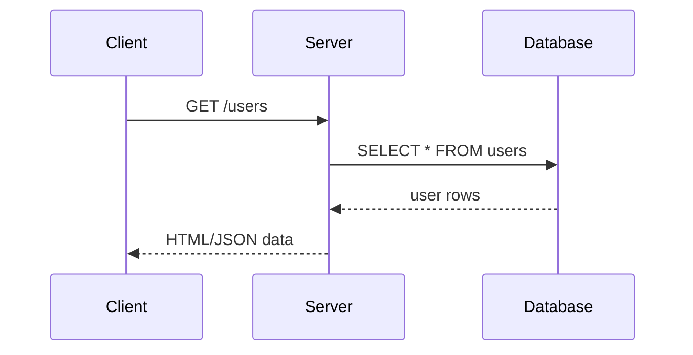

### Java Web Apps

---

### How the Web Works

- browser sends request to server
- server checks data in DB
- server sends response to browser

+++



---

### Spring Framework

- Framework for building apps in Java
- Powerful ecosystem with many extensions/libraries

+++

### Why use a Framework

- follow established conventions
- reusue existing code
- speed up development

+++

### Example
- receive request/send response using Spring Web
- connect to SQL Server using SQL Server Adapter
- interface with database using JDBC/Hibernate
- generate HTML using Thymeleaf
- interface with third party services via SDKs, e.g. Paypal

---

### Exercise: Nextagram V1

- HTML -> homepage displaying all images
- JSON -> list of users
- JSON -> list of images for a user
- no database, all data is hardcoded

---

### Phase 1: Homepage

- initialize in Spring Tools Suite
- hardcode images data 
- create GET endpoint returning HTML
- create HTML template for homepage

+++

### Initialization

- Spring Web
- Spring Dev Tools
- ThymeleafT

+++

### Harcode Images Data

- create `Image` class
- properties: `id`, `url`
- hardcode 12 images

+++

### GET endpoint

- create controller
- add required annotations
- import hardcoded images

+++

```java
// UserController.java
import org.springframework.stereotype.Controller;
import org.springframework.web.bind.annotation.GetMapping;

@Controller
public class UserController {
    @GetMapping(path="/")
    public String home() {
        return "home";
    }
}
```

```html
// resources/templates/home.html
<h1>This is the Homepage</h1>
```

+++

### HTML Template

- create .html file
- add mappings in controller
- use mappings in html file

+++

Map Java variables to Thymeleaf Variables

```java
@GetMapping(path="/users")
public String users(Model model) {
    String[] users = {"John", "Jane"};
    model.addAttribute("users", users);
    return "users";
}
```

+++

Use Thymeleaf variables in HTML

```html
<ul th:each="user : ${users}">
    <li th:text="${user}">1</li>
</ul>
```

---

### Rendering Different Pages

- based on URL (e.g. /uses/1)
- based on URL params (e.g. /users?name=mingxiang)

+++

### Based on URL Path

```java
@GetMapping(path="/user/{name}")
public String user(@PathVariable("name") String name) {
    model.addAttribute("name", name);
    return "user";
}
```

+++

### Based on URL Params

```java
@GetMapping(path="/users")
public String users(@RequestParam(name = "age") int age) {
    model.addAttribute("age", age);
    return "users";
}
```


---

### Phase 2: JSON -> List of users

- hardcode users data 
- create GET endpoint returning JSON
- process users data into JSON

---

### Phase 3: JSON -> List of images for a user

- hardcode users -> images data
- create GET endpoint returning JSON
- process user ID to get correct list of images