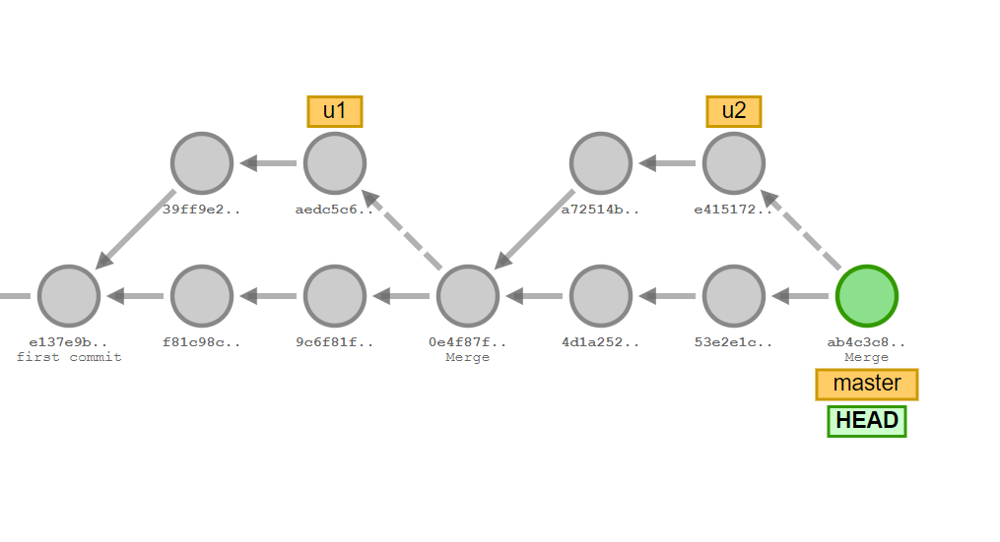
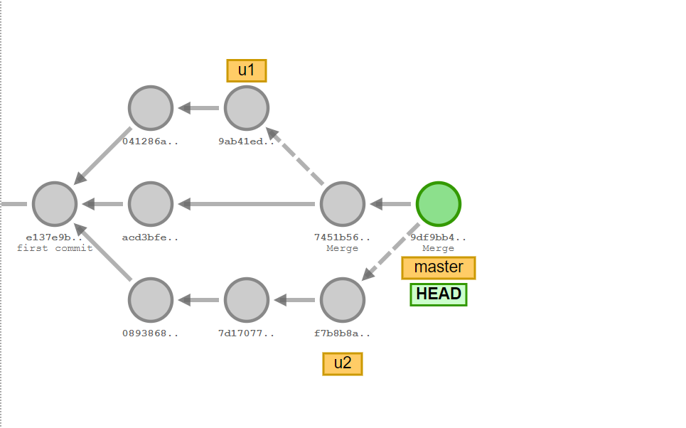
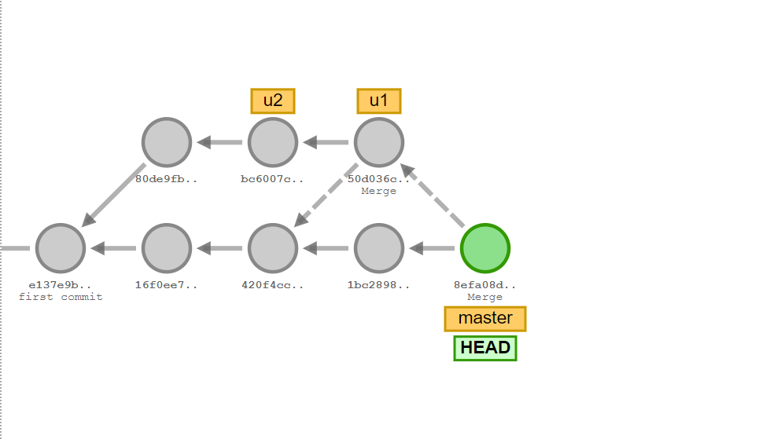

### Collaborating with Git

+++

### Topics

- what is git
- why do we use git
- how do we use git

---

### Links

- [Visualizing Git](https://git-school.github.io/visualizing-git/)
- [VSCode Git Graph](https://marketplace.visualstudio.com/items?itemName=mhutchie.git-graph)

---

#### So Far

1. git clone
2. git commit
3. git push

---

#### Git Branching

+++

- `git branch <branch-name>`
- `git checkout <branch-name>`
- `git merge <branch-name>`

+++

`HEAD`

- represents current position

+++

`git branch <branch-name>`

- creates a branch at the current HEAD

+++

`git checkout <branch-name>`

- moves current HEAD to the last commit for the specified branch

+++

`git merge <branch-name>`

- merge all commits from branch to current HEAD

---

### Exercises

+++

+++

+++

---

### Exercise

+++

### Instructions

1. Create a new folder
2. add a new file message.txt
3. edit its contents with some message
4. run Git: Initialize via Ctrl Shift P
5. run Git: Commit All via Ctrl Shift P

+++

### Branch Creation

1. in terminal, run git checkout -b <branch-name>
2. via Ctrl Shift P -> Git: Create Branch
3. in VSCode, lower left corner indicates current branch

+++

### Instructions

1. Create 3 branchs, x, y, z
2. add 2 commits on x
3. add 3 commits on y
4. add 1 commit on z
5. merge x into master
6. merge y into master
7. merge z into master

---

#### Git Remotes

+++

- `git clone <url>`
- `git push origin <branch>`
- `git fetch origin <branch>`
- `git pull origin <branch>`
- `git checkout --track origin/<branch-name>`

+++

### Exercise

- create a repo on github
- run the git remote add origin your-url in terminal
- push branches master, x, y, z to github

+++

### Instructions

- delete your folder
- git clone it
- pull each branch from origin

---

### Assignment

+++

### Create an angular app

- similar to [this](https://coinmarketcap.com/)
- have a [homepage](https://coinmarketcap.com/) displaying a list of items
- have a [page](https://coinmarketcap.com/currencies/bitcoin/) displaying stats for a specific item
- don't need to replicate everything(e.g. nested tabs)

+++

### Requirements

- use Bootstrap to do the styling
- use 1 branch per page
- merging should happen via pull requests
- at least 2 commits per branch
- at least 1 chart 
- at least 1 table per page

+++

### Tips

- just hardcode the data
- don't replicate everything
- main goal is bootstrap + git and angular recap

