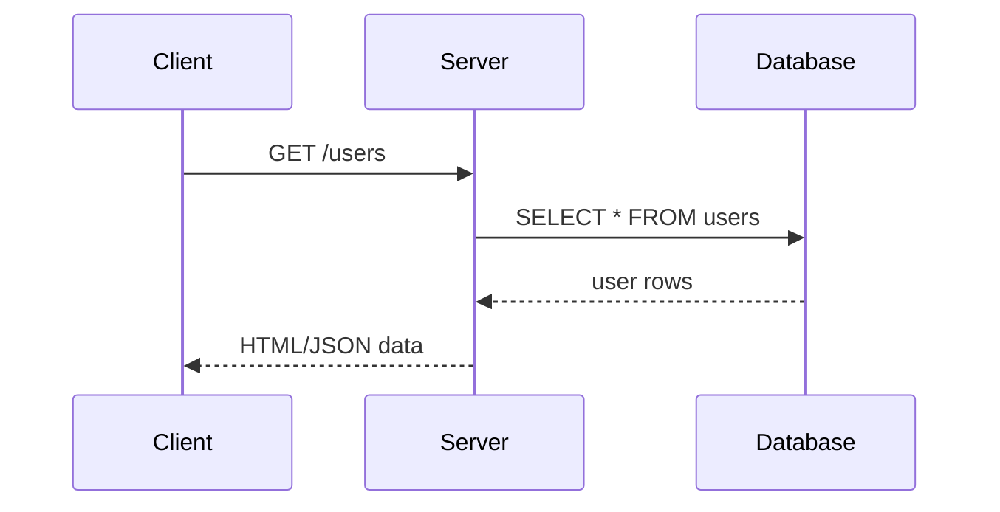

## Node Web Apps (With Express)

---

### How the web works
- browser sends request to server
- server checks data in DB
- server sends response to browser

+++

### Responses can be 
- a web page of:
  - HTML
  - JS
  - CSS
- OR data of various types:
  - text
  - json
  - etc...

+++



---

### GET Request
- used to `GET`/obtain data

+++

### Exercise
- use `Postman` to make a `GET` request to obtain chat data from PLACEHOLDER_LINK

+++

### POST Request
- used to `POST` data, i.e make changes to a database within an application

+++

### Exercise
- use `Postman` to make a `POST` request to add a new message to the chat storage at PLACEHOLDER_LINK

---

## Express JS
- a framework to build simple web applications

---

### Barebones Express App
- Clone from [this](PLACEHOLDER_LINK)

+++

```javascript
app.get("/helloWorld", (req: Request, res: Response) => {
    res.json({
        message: "Hello World"
    })
});

app.<action>("/<path>", (req: Request, res: Response) => {
  // retrieve information from req
  req.params
  req.query
  // send response using res
  res.send(data) // sends data
  res.json(data) // sends json
  res.sendStatus(statusCode) // sends status
  res.status(statusCode).send(data) // sends data with status

})
```

---

### Basic Express template 
- Clone [here](PLACEHOLDER_LINK)

+++

### Folder Structure
- 

+++

- `controller` stores the logic for each route
- `routes` stores the configuration for all the routes

---

### Nextagram
- v1: show homepage displaying all images (GET)
- v2: return json data of all users (GET)
- v3: add data to application (POST)

---

### Phase 1: Render Static Pages (Homepage)
- render a HTML page with CSS styles

+++

### Controller
```javascript
// controller/HomePageController.ts
export class HomePageController {
    async home(request: Request, response: Response, next: NextFunction) {
        response.sendFile(ABSOLUTE_HTML_FILEPATH)
    }
}
```

+++

```javascript
// routes.ts
export const Routes = [{
    method: "get", // request method
    route: "/home", // path
    controller: HomePageController, // controller
    action: "home" // controller method name
}];
```

+++

### Exercise
- /about-us
- /contact-us

---

### Phase 2: Return data (Raw JSON String)
- hardcodes users data
  ```javascript
    [
      {
        "id": 1,
        "avatar": "http://img_store/test_user_1.img",
        "username": "Test User 1"
      },
      {
        "id": 2,
        "avatar": "http://img_store/test_user_2.img",
        "username": "Test User 2"
      },
      // ...
    ]
  ```
- return raw json data

+++

#### Defining Parameters
```javascript
// routes
export const Routes = [{
    method: "get",
    route: "/testing/:testValue",
    controller: TestController,
    action: "test"
}]
```

+++

#### Setting Parameters/Query Strings
```bash
# Parameters: sets parameter key testValue as 1
localhost:3000/testing/1

# Query String: sets query string key testValue as 1
localhost:3000/testing?testValue=1
```

+++

#### Using Parameters/Query Strings
```javascript
  // controller
  class TestController {
    async test(request: Request, response: Response, next: NextFunction) {
        // Getting path variables
        request.params[path_key] // request.params.path_key
        // Getting query strings
        request.query[query_key] // request.query.query_key
    }
  }
```

+++

### Exercise
- /api/users/1
  ```javascript
    {
      "id": 1,
      "username": "Test User 1",
      "avatar": "http://img_store/test_user_1.img",
      "images": [
        "http://img_store/users/1/img_1",
        "http://img_store/users/1/img_2",
        "http://img_store/users/1/img_3",
      ]
    }
  ```

+++
- /api/messages
  ```javascript
    [
      {
        "id":1,
        "text": "Hello world!",
        "user_id": 1,
        "datetime": "2019/08/19 16:01:37"
      },
      // ...
    ]
  ```

---

### Phase 3: Add data (POST)
- POST /api/sign_up
  ```javascript
    {
      "username": "Test User 3",
      "avatar": "http://test_image_link.jpg"
    }
  ```

+++

#### Reading request body data
```javascript
  // controller
  class TestController {
    async testPost(request: Request, response: Response, next: NextFunction) {
        // returns the body in POST request
        request.body
    }
  }
```
+++

### Exercise
- POST /api/messages
  ```javascript
    {
      "text": "Hello!!!",
      "user_id": 1,
      "datetime": "2019/08/19 16:01:37"
    }
  ```

+++
- POST /api/users/1/images
  ```javascript
    {
      "image_url": "http://image_link.jpg"
    }
  ```

---

## Deployment: Part 1

---

### What is a Live Site?
- running on a server
- accessible on a public URL
- connected to LiveDB and other services

---

### Heroku
- Cloud Provider
- provides servers running 24/7

Link: https://devcenter.heroku.com/articles/getting-started-with-nodejs

+++

### Setup
- Download CLI
  ```bash
    npm install -g heroku
  ```
- Sign up Account @ 
  - https://signup.heroku.com

+++

### CLI Login
```bash
  # Enter the following and follow instructions
  heroku login
```

---

### Basic Express App Deployment
<!-- TODO -->
- Modify app template
- 

---

### Environment Variables (env)

+++

### Why use env?
<!-- TODO -->

+++

### How
<!-- TODO -->

---

### Exercise
<!-- TODO -->
<!-- Different messages for different environments -->

---

## Object Relational Mapping

---

### DB Setup
- Setting up Postgresql Locally

---

### TypeORM


---

### Migration Management

---

### Entities

---

### Relationships

---

### Commands

---

### Exercise

---

### JSON Serialization ( Returning JSON data from TypeORM)

---

## Deployment: Part 2

---

### Cloud DB
- a database running on the cloud
- not on your computer

+++

### Provision DB
<!-- TODO -->

+++

### Create TypeORM Postgresql Project

---

### Attach DB to Prod Application
- provision cloud service
- get url, username, password, db_name
- set credentials in spring app

+++

### How
<!-- TODO -->

---
